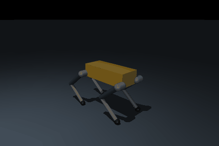
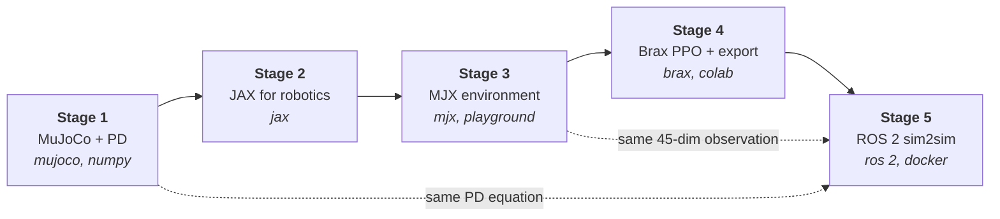

# HRC Software Onboarding — Fall 2026

**Purdue Humanoid Robotics Club · software team**

You are going to build the exact pipeline the club
uses to make NEMO walk: a MuJoCo robot with a PD controller, a vectorized
JAX/MJX environment, a Brax PPO training run, an exported numpy policy, and ROS 2
nodes running that policy against a simulator through the same interfaces the
real hardware uses. The robot is a 12-DoF quadruped called **Pup**. By the end
you will have written a piece of every stage yourself, and you will have a
walking robot to show for it.



## The pipeline



| Stage | Doc | You write | Time |
|---|---|---|---|
| 0 | [Setup](docs/00_setup.md) | — | 0.5–1 h |
| 1 | [MuJoCo and the PD controller](docs/01_mujoco_and_pd.md) | `PDController`, `stand_up`, gain tuning | 2 h |
| 2 | [JAX for robotics](docs/02_jax_for_robotics.md) | three JAX exercises, quaternion maths | 1.5 h |
| 3 | [The MJX environment](docs/03_mjx_environment.md) | observation, termination, commands, `step`, three reward terms | 4 h |
| 4 | [Training with Brax PPO](docs/04_training_with_brax.md) | the training wiring, `export_policy`, `NumpyPolicy` | 2.5 h |
| 5 | [ROS 2 sim2sim](docs/05_ros2_sim2sim.md) | `policy_node`, the launch file | 3 h |

**Total: ~13.5 hours of hands-on work.** This is a generous estimate, and it very possible to finish in much less time.

Also useful: [glossary](docs/glossary.md) ·
[FAQ and troubleshooting](docs/faq_and_troubleshooting.md) ·
[reading packet](docs/reading_packet.md)

## Start here

```bash
# 1. Click "Use this template" on GitHub, then:
git clone https://github.com/<your-username>/onboarding-fall26.git
cd onboarding-fall26

# 2. Install
curl -LsSf https://astral.sh/uv/install.sh | sh     # if you don't have uv
uv python install 3.11
uv sync

# 3. Check
uv run python scripts/check_setup.py
uv run python scripts/progress.py
```

Then open [`docs/00_setup.md`](docs/00_setup.md).

## Experience assumptions

We assume you can program in Python, use `git`, and have seen `numpy` arrays
before. We assume **no** background in robot control, reinforcement learning,
JAX, or ROS 2 — every one of those is taught here from zero.

If you have never used the command line for anything beyond `git commit`, this
will be hard but not impossible; budget extra time for Stage 0 and Stage 5, and
ask in Discord early rather than late.

## System requirements

| | Minimum | Notes |
|---|---|---|
| OS | Linux, macOS, or Windows 11 + WSL2 | Linux native is the smoothest |
| Python | 3.11 (3.12 works) | not 3.13 — no `jaxlib` wheel |
| RAM | 8 GB | 16 GB is more comfortable |
| Disk | ~6 GB | ~2 GB of that is the ROS 2 Docker image |
| GPU | not required | Stage 4 uses a free Colab T4; everything else is CPU |
| Docker | required for Stage 5 | or a native ROS 2 Jazzy install |

Stages 1–3 and 5 run on any laptop. Stage 4 is the only one that wants a GPU,
and there is a Colab notebook for it.


## Tests and markers

Your progress bar is:

```bash
uv run python scripts/progress.py          # per-stage checklist
uv run python scripts/progress.py --slow   # also runs the PPO smoke test
```

Tests report **▷ NOT STARTED** (the function still raises `NotImplementedError`),
**✗ FAILED** (you wrote something and it's wrong), or **✓ PASSED**.

| Marker | Needs | Runs by default? | Command | What it covers |
|---|---|---|---|---|
| *(none)* | CPU only | yes | `pytest` | Stages 1–3 and the Stage 4 export equivalence check |
| `slow` | CPU, under a minute | yes | `pytest -m slow` | the Stage 4 `cpu_smoke` PPO run, end to end |
| `gpu` | an NVIDIA GPU | auto-skipped without one | `pytest -m gpu` | JAX really is on the GPU; vmapped env throughput |
| `ros` | the ROS 2 container | auto-skipped outside it | `pytest -m ros` inside the container | `policy_node`'s observation, ordering, and 50 Hz publish |

Stage 5 as a whole is checked by `tests/test_05_ros2_smoke.sh`, which runs the
`ros` tests and then launches the real stack. It runs inside the container:

```bash
docker compose -f docker/compose.yaml run --rm ros2 /ws/tests/test_05_ros2_smoke.sh
```

The default CPU suite finishes in well under ten minutes.

## Submission

1. Commit your work, plus a `results/` directory containing your learning-curve
   PNG, `eval_training.json`, `eval_sim2sim.json`, and your GIFs.
2. Fill in [`SUBMISSION.md`](SUBMISSION.md) — the stage checklist, your pasted
   `scripts/progress.py` output, your eval numbers, any escape hatches you used,
   the Stage 5 reflection paragraph, and what was hardest.
3. Push to your own `onboarding-fall26` repository.
4. **DM the software lead (Henry Tsay) on Discord once you are done or show it at a meeting.**
