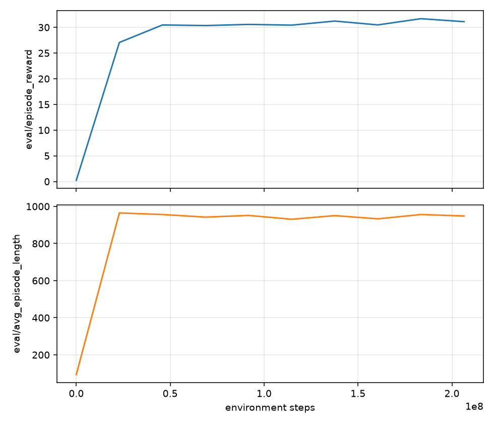
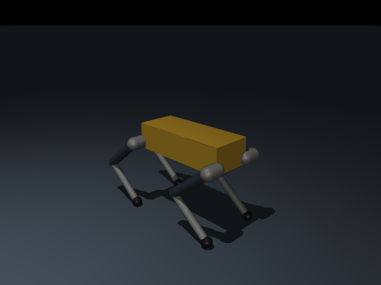

# Submission — HRC Software Onboarding Fall 2026

**Name:** Quinn Winkler
**Discord handle:** @grmpn
**Repository:** https://github.com/grmpn/onboarding-fall26/tree/main
**Date:** 9/22/2026

---

## Stage checklist

- [x] **Stage 0** — Setup. `scripts/check_setup.py` exits 0.
- [x] **Stage 1** — MuJoCo + PD controller. Tests green.
- [x] **Stage 2** — JAX exercises. Tests green.
- [x] **Stage 3** — MJX environment. Tests green.
- [x] **Stage 4** — Brax PPO. Trained a policy, exported it, `NumpyPolicy` matches.
- [x] **Stage 5** — ROS 2 sim2sim. Smoke test green, teleop GIF recorded.

## `scripts/progress.py` output

<details>
<summary>paste the full output here</summary>

```
[100%]
================================== warnings summary ===================================
.venv/lib/python3.11/site-packages/jaxopt/__init__.py:59
  /home/rainb/dev/onboarding-fall26/.venv/lib/python3.11/site-packages/jaxopt/__init__.py:59: DeprecationWarning: JAXopt is no longer maintained. See https://docs.jax.dev/en/latest/ for alternatives.
    warnings.warn(

tests/test_04_train_smoke.py::test_cpu_smoke
  /home/rainb/dev/onboarding-fall26/.venv/lib/python3.11/site-packages/brax/training/agents/ppo/train.py:756: DeprecationWarning: jax.device_put_replicated is deprecated; use jax.device_put instead.
    training_state = jax.device_put_replicated(

-- Docs: https://docs.pytest.org/en/stable/how-to/capture-warnings.html

Pup onboarding progress
  ✓ PASSED        Stage 1  MuJoCo + PD controller    12 passed, 0 failed, 0 not started, 0 skipped
  ✓ PASSED        Stage 2  JAX for robotics          9 passed, 0 failed, 0 not started, 0 skipped
  ✓ PASSED        Stage 3  MJX environment           11 passed, 0 failed, 0 not started, 0 skipped
  ✓ PASSED        Stage 4  Brax PPO + export         4 passed, 0 failed, 0 not started, 0 skipped
36 passed, 1 skipped, 2 deselected, 2 warnings in 300.59s (0:05:00)

==============================================================================
PUP ONBOARDING PROGRESS
==============================================================================
✓ PASSED         Stage 1  MuJoCo + PD controller    12 passing
✓ PASSED         Stage 2  JAX for robotics          9 passing
✓ PASSED         Stage 3  MJX environment           11 passing
✓ PASSED         Stage 4  Brax PPO + export         4 passing
◻ CONTAINER      Stage 5  ROS 2 sim2sim             run tests/test_05_ros2_smoke.sh inside docker/ros2
==============================================================================
Every TODO(student) block is written. Nice.
```

</details>

## Stage 4 — training results

**Config used:** `full` &nbsp; **Seed:** &nbsp; `0`
**Where it ran:** `local GPU` &nbsp; **Wall-clock:** `2032.95 sec`

Learning curve: 
Rollout GIF:


```json
{
  "seed": 0,
  "n_episodes": 5,
  "commands": [
    {
      "command": [
        0.5,
        0.0,
        0.0
      ],
      "mean_abs_error": [
        0.039904504466056825,
        0.04089196363860974,
        0.05232072753300745
      ],
      "mean_abs_vy": 0.04089196026325226,
      "mean_speed": 0.49624648690223694,
      "fall_rate": 0.0,
      "mean_episode_length": 1000.0
    },
    {
      "command": [
        1.0,
        0.0,
        0.0
      ],
      "mean_abs_error": [
        0.06981571603566408,
        0.04645529547878541,
        0.055648085982265914
      ],
      "mean_abs_vy": 0.046455297619104385,
      "mean_speed": 0.9448948502540588,
      "fall_rate": 0.0,
      "mean_episode_length": 1000.0
    },
    {
      "command": [
        0.0,
        0.5,
        0.0
      ],
      "mean_abs_error": [
        0.03022829534811317,
        0.056366150955110786,
        0.04546487569564779
      ],
      "mean_abs_vy": 0.4526454508304596,
      "mean_speed": 0.4544018507003784,
      "fall_rate": 0.0,
      "mean_episode_length": 1000.0
    },
    {
      "command": [
        0.0,
        0.0,
        1.0
      ],
      "mean_abs_error": [
        0.032827755844833155,
        0.035688277731504056,
        0.049569217026233674
      ],
      "mean_abs_vy": 0.03568827360868454,
      "mean_speed": 0.053678613156080246,
      "fall_rate": 0.0,
      "mean_episode_length": 1000.0
    },
    {
      "command": [
        0.0,
        0.0,
        0.0
      ],
      "mean_abs_error": [
        0.03634914392453793,
        0.034427675451246614,
        0.07420536689083675
      ],
      "mean_abs_vy": 0.03442768007516861,
      "mean_speed": 0.05580662935972214,
      "fall_rate": 0.0,
      "mean_episode_length": 1000.0
    }
  ],
  "walking_passes": true
}
```

Did it meet the acceptance criteria (`"walking_passes": true`)? **Yes**

## Stage 5 — sim2sim results

Teleop GIF: `results/sim2sim_teleop.gif`

```json
{
  "duration_s": 20.0,
  "min_trunk_height": 0.2918518578740899,
  "fell": false,
  "commands": [
    {
      "command": [
        0.5,
        0.0,
        0.0
      ],
      "n_samples": 141,
      "mean_velocity": [
        0.33677393522177673,
        -0.004729340235666565,
        -0.005449386429626032
      ],
      "mean_abs_error": [
        0.16322606477822327,
        0.004729340235666565,
        0.005449386429626032
      ],
      "mean_speed": 0.337434580727315,
      "threshold": 0.25,
      "passed": true
    },
    {
      "command": [
        1.0,
        0.0,
        0.0
      ],
      "n_samples": 150,
      "mean_velocity": [
        0.843335717582155,
        -0.03531181183142795,
        0.0003466282250137058
      ],
      "mean_abs_error": [
        0.15666428241784502,
        0.03531181183142795,
        0.0003466282250137058
      ],
      "mean_speed": 0.8445633590137414
    },
    {
      "command": [
        0.0,
        0.0,
        1.0
      ],
      "n_samples": 150,
      "mean_velocity": [
        -0.06416409536254672,
        0.003825803105131201,
        0.9952386639413882
      ],
      "mean_abs_error": [
        0.06416409536254672,
        0.003825803105131201,
        0.0047613360586118425
      ],
      "mean_speed": 0.0689426581764837
    },
    {
      "command": [
        0.0,
        0.0,
        0.0
      ],
      "n_samples": 150,
      "mean_velocity": [
        -0.08860984203253898,
        -0.021650206377836004,
        -0.007690708465040936
      ],
      "mean_abs_error": [
        0.08860984203253898,
        0.021650206377836004,
        0.007690708465040936
      ],
      "mean_speed": 0.09269261384219624
    }
  ],
  "passed": true
}
```

Measured `/pup/joint_command` rate from `ros2 topic hz`: **50.0 hz**

## Escape hatches used

- [ ] I used `checkpoints/pup_joystick_flat_reference.npz` for Stage 5 instead
      of my own policy.
- [ ] Other (describe):

*(Using one is fine. Not declaring one is not.)*

## Reflection — Stage 5

**List two ways sim2sim can pass while real hardware still fails, and what you
would add to the sim node to catch each.**

>Sim2sim could fail to account for varying ground frictions and the robot starting at a position that varies from the exact home position. To evaluate under differing conditions better, the sim node could slightly randomize ground friction in `self.model` for each trial and robot home position slightly in `self.data` on each reset.  

## What was hardest?

One paragraph. This is will help us improve onboarding.

>The most confusing part for me was the Colab training workflow. The instructions suggest starting the Colab run before completing tasks 4 and 5, but the notebook depends on the task 4 implementation. When I was updating the code, I messed up by deleting and re-cloning the repo inside Colab instead of using git pull, which erased training progress. I think adding a small git pull code block into the notebook could improve the Colab training section. 


## Time spent

| Stage           | Hours |
| --------------- | ----- |
| 0 Setup         | 0.1   |
| 1 MuJoCo + PD   | 1     |
| 2 JAX           | 1     |
| 3 MJX env       | 3     |
| 4 Brax + export | 3     |
| 5 ROS 2         | 1.5   |
| **Total**       | ~9.6  |

---

**Then DM the software lead (Henry Tsay) on Discord or show during a meeting.**
