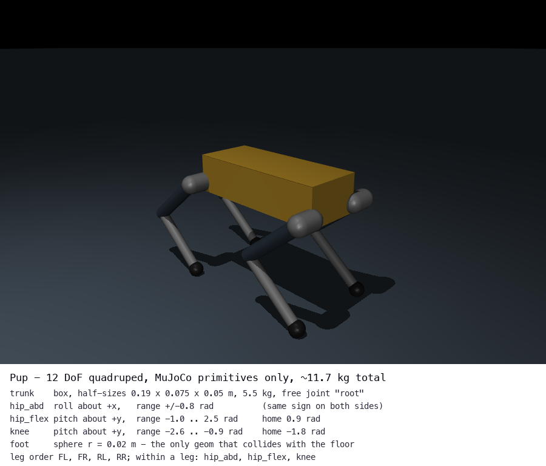
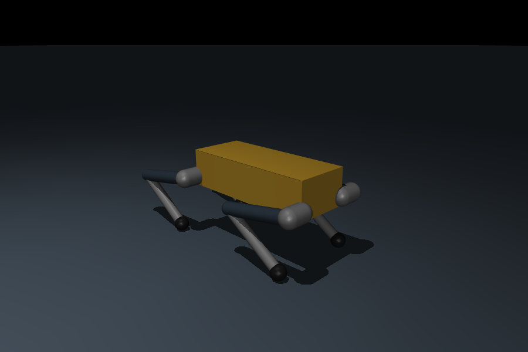
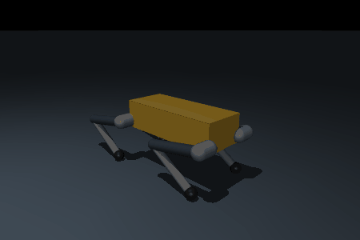

# Stage 1 — MuJoCo and the PD controller

**Time budget: ~2 h. Lines you write: ~60.**



## Why this exists

Every line of this repository eventually turns into a number in
`data.ctrl[]`. Before you can reason about reinforcement learning, you need a
concrete picture of what a simulator step actually is: a state vector `qpos`, a
velocity vector `qvel`, a control vector `ctrl`, and a function that advances
them by `timestep` seconds.

The second thing you need is the **joint PD controller**:

```
tau = kp * (q_des - q) + kd * (qd_des - qd)
```

A learned policy does not output torques. It outputs *joint position targets*,
and something underneath turns those targets into torques with the equation
above. In
Stage 3 it is MuJoCo's `<position>` actuator running inside the MJX step. In
Stage 5 it is `pup_sim/sim_node.py` running at 250 Hz.

## Concepts you need

- **`qpos` / `qvel` / `ctrl`.** `qpos` holds generalized *positions*, `qvel`
  generalized *velocities*, `ctrl` the actuator inputs. For Pup:
  `nq = 19`, `nv = 18`, `nu = 12`.
- **The free joint offset.** Pup's trunk has a `<freejoint>`, which occupies
  **7 numbers in `qpos`** (x, y, z, then a `wxyz` quaternion) but only **6 in
  `qvel`** (three linear, three angular rates). A quaternion needs four numbers
  to represent three degrees of freedom. That is why the actuated joints start
  at `qpos[7]` and `qvel[6]`, and getting this wrong by one is the single most
  common bug in this repository. It will come back in Stage 3 and again in
  Stage 5.
- **Torque vs position control.** A `<motor>` actuator: `ctrl` *is* the torque.
  A `<position kp kv>` actuator: `ctrl` is a target angle and MuJoCo runs the PD
  loop for you at physics rate.
- **Keyframes.** `home` (standing, trunk z ≈ 0.29 m, joints
  `[0, 0.9, −1.8]` per leg) and `crouch` (`[0, 1.4, −2.4]`, trunk z ≈ 0.19 m).
  You start from `crouch` and drive to `home`:

  

> **Reading:** the MuJoCo overview and "Computation" chapters
> ([reading packet](reading_packet.md), Stage 1 items). Ten minutes on
> `mjModel` vs `mjData` saves an hour later.

### The robot

Pup is a 12-DoF quadruped built entirely from boxes, capsules and spheres — no
meshes, so the whole robot is one commented XML file you are encouraged to
open (`pup/assets/pup.xml`). Legs are `FL`, `FR`, `RL`, `RR`; each has `hip_abd` (roll), `hip_flex`
(pitch), `knee` (pitch), and they appear in `qpos[7:]` in exactly that order:

```
FL_hip_abd, FL_hip_flex, FL_knee, FR_hip_abd, ... , RR_knee
```

`pup/envs/constants.py` is the single source of truth for that ordering; import
`JOINT_NAMES` and `DEFAULT_POSE` rather than retyping it.

**Sign convention:** both sides use the same axes (`hip_abd` about `+x`,
`hip_flex` and `knee` about `+y`). Only the *lateral offset* of the hip body is
mirrored. So a positive `hip_abd` swings the left and right legs the *same*
direction in world space, not symmetrically outwards.

Only the four foot spheres collide, with the floor and nothing else. Everything
else has `contype=0 conaffinity=0`. This keeps MJX fast (4 possible contacts,
not 40) and stops self-collision from silently eating your reward.

## Your task

### 1. `pup/sim/pd.py` — `PDController` and `joint_state`

```python
class PDController:
    def __init__(self, kp, kd, torque_limit: float = 20.0): ...
    def __call__(self, q, qd, q_des, qd_des=None) -> np.ndarray:  # (12,) Nm
```

Three TODO blocks:

- store `kp`, `kd` (scalar *or* `(12,)`) and `torque_limit`;
- compute `kp * (q_des − q) + kd * (qd_des − qd)` and clip to
  `[−torque_limit, +torque_limit]`. When `qd_des` is `None`, treat it as zeros —
  that is the common case and it turns the D term into pure damping;
- `joint_state(model, data)` returns `(q, qd)`, both `(12,)`, sliced past the
  free joint. **Return copies**, not views — the test checks that mutating what
  you return does not corrupt `data`.

### 2. `pup/sim/standup.py` — `stand_up`

Start at the `crouch` keyframe. Linearly interpolate `q_des` from the crouch
pose to the home pose over the first **1.0 s**, then hold it until
`duration_s`. Step the simulation with your `PDController`, and return:

```python
{"final_height": float,   # trunk z at the end, m
 "max_roll": float,       # peak |roll|, rad
 "max_pitch": float,      # peak |pitch|, rad
 "fell": bool}            # True if it ever dropped below 0.12 m or went non-finite
```

Roll and pitch come from the trunk quaternion `data.qpos[3:7]` (`wxyz`):

```python
w, x, y, z = data.qpos[3:7]
roll  = np.arctan2(2 * (w*x + y*z), 1 - 2 * (x*x + y*y))
pitch = np.arcsin(np.clip(2 * (w*y - z*x), -1.0, 1.0))
```



### 3. Tune the gains

`stand_up` takes `kp` and `kd`. Start at **`kp = 40`, `kd = 1.0`** and watch
what happens when you change them:

| Symptom | Cause | Fix |
|---|---|---|
| Never reaches home height, sags | `kp` too low for 12 kg | raise `kp` |
| Visible buzz / high-frequency shake | `kp` too high for the damping | raise `kd`, or lower `kp` |
| Overshoots then oscillates a few times | `kd` too low | raise `kd` |
| Sluggish, arrives late | `kd` too high | lower `kd` |

`test_default_gains_are_tuned` reads the **defaults you leave in
`stand_up`'s signature** and requires `kp ∈ [35, 80]` and `kd ∈ [0.3, 2.5]`,
*and* that those gains actually pass the behavioural checks. Below about
`kp = 35` a pure PD controller cannot hold 12 kg against gravity without sagging
more than the 0.03 m the test allows — that steady-state droop is real, not a
bug, and it is why real robots add gravity compensation or a feed-forward term.

Watch it with:

```bash
uv run python -c "from pup.sim.standup import stand_up; print(stand_up(kp=40, kd=1.0))"
# with a window (macOS needs mjpython):
uv run mjpython -c "from pup.sim.standup import stand_up; stand_up(headless=False, duration_s=8)"
```

### 4. Now you're allowed to use the built-in

Open
`pup/assets/scene_flat_mjx.xml`: the actuators are

```xml
<position joint="FL_hip_abd" kp="25" kv="0.5" forcerange="-20 20"/>
```

Write ~15 lines that prove this is *your* controller in disguise: load the MJX
scene, set `data.ctrl` to some joint target, call `mujoco.mj_forward`, and
compare `data.actuator_force` against `PDController(25, 0.5)(q, qd, ctrl)`.
They agree to 1e-3. `test_01_pd.py::test_matches_position_actuator` does exactly
this over 200 steps with a moving target; read it, then convince yourself.

Why does the RL environment use the built-in? Because inside MJX the PD loop
runs at *physics* rate (250 Hz) while the policy runs at 50 Hz, and expressing
that as a Python loop inside a jitted function is both slower and more code than
letting MuJoCo do it.

## How you'll know you're done

```bash
uv run pytest tests/test_01_model.py tests/test_01_pd.py tests/test_01_standup.py -v
```

- `test_01_model.py` — the XML loads in both MuJoCo and MJX, has 12 actuators
  and the expected sensors, has a `home` keyframe, and after 100 steps from
  `home` **all four feet and only the feet** are in contact with the floor.
- `test_01_pd.py` — zero error gives zero torque; the sign is right; torques
  clip at ±20 Nm; per-joint gain arrays work; and your controller matches
  MuJoCo's position actuator to 1e-3.
- `test_01_standup.py` — `fell is False`, final height within 0.03 m of the
  `home` keyframe height, `max_roll` and `max_pitch` below 0.15 rad, for three
  different gain pairs; plus a five-second standing test where the trunk height
  never drifts more than 0.03 m.

## Common mistakes

- **`qpos[6:]` instead of `qpos[7:]`.** You get the last quaternion component as
  a "joint angle" and everything is off by one. If your torques look plausible
  but the robot spirals, check this first.
- **`qvel[7:]` instead of `qvel[6:]`.** Same bug, other array, and it only
  shows as a shape error if you're lucky.
- **Sign flip on the D term.** With `qd_des = 0` the term is `−kd * qd`. If you
  write `+kd * qd` you have built an oscillator, and it will look like "the
  gains are too high" no matter what you set them to.
- **Clipping before summing.** Clip the total torque, once, at the end.
- **Returning views from `joint_state`.** `data.qpos[7:]` is a live view into
  MuJoCo's buffer; it changes under you on the next `mj_step`. Use `.copy()`.
- **Comparing against `data.ctrl` in the motor scene.** `actuator_force` only
  equals your PD output in the *position*-actuator scene
  (`scene_flat_mjx.xml`).